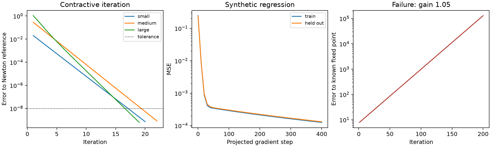

建议使用**每轮注入输入、对状态严格收缩的迭代模块**。我已经完成 3 维 NumPy CPU 实例，实际训练并验证了收敛、自动停止误差和失败对照；代码及原始结果在 [baseline-probe](./baseline-probe/)。

取状态与输入 $z,x\in\mathbb R^d$，定义

$$
z_{n+1}=F_\theta(z_n,x)=\tanh(Az_n)+Bx,
\qquad \|A\|_2\le q<1,\quad B=I+C,\quad\|C\|_2\le\eta<1.
$$

第一版固定 $q=0.8,\eta=0.25$，训练 $A,C$，输出最终状态本身。输入项放在非线性外侧，便于同时得到收敛和输入分离的保证。每次参数更新后，对 $A,C$ 分别做谱范数球投影：SVD 后将奇异值截到 $q,\eta$。小实例直接计算 SVD，不依赖可能低估谱范数的少量 power iteration。

**收敛与不塌缩是两个分别成立的结论。**

固定 $x$ 时，由 tanh 的 1-Lipschitz 性，

$$
\|F_\theta(z,x)-F_\theta(w,x)\|_2\le q\|z-w\|_2.
$$

整个 $\mathbb R^d$ 是完备空间，且映射到自身，因此每个输入有唯一固定点 $z^*(x)$，从任意有限初值出发都收敛：

$$
\|z_n-z^*(x)\|_2\le q^n\|z_0-z^*(x)\|_2.
$$

这是 Banach 收缩映射定理的应用，完备空间、自映射和统一收缩常数是条件。[Cornell 数值分析讲义](https://www.cs.cornell.edu/courses/cs4220/2026sp/lec/2026-03-27.html)

“每个输入只有一个固定点”不等于“所有输入共用一个固定点”。对两个输入，将固定点方程相减：

$$
B(x-x')=z^*(x)-z^*(x')-
\bigl[\tanh(Az^*(x))-\tanh(Az^*(x'))\bigr].
$$

又因为 $\sigma_{\min}(B)\ge1-\eta$，可得

$$
\boxed{
\frac{1-\eta}{1+q}\|x-x'\|_2
\le\|z^*(x)-z^*(x')\|_2
\le\frac{1+\eta}{1-q}\|x-x'\|_2.
}
$$

所以不同输入有不同固定点，并至少保留 $0.75/1.8\approx0.4167$ 倍的输入距离。这里不需要额外防塌缩 loss，但代价是限制了可表达的状态映射：状态维度等于输入维度，并强制保留输入差异。若之后加任意输出头，这个分离保证不会自动传到输出头。

持续输入 $x$ 也符合 equilibrium model 的输入注入思想；只用 $x$ 初始化状态，在唯一固定点假设下会逐渐丢失初始输入。[DEQ 作者教程](https://implicit-layers-tutorial.org/deep_equilibrium_models/)

**停止规则对应明确的状态误差。**

每次算出新状态后，计算

$$
\Delta_n=\|z_n-z_{n-1}\|_2,\qquad E_n=\frac{q}{1-q}\Delta_n.
$$

后续增量至多为 $q\Delta_n,q^2\Delta_n,\ldots$，几何级数给出 $\|z_n-z^*\|_2\le E_n$。因此 $E_n\le\varepsilon$ 就返回更新后的 $z_n$；超出最大迭代数仍未满足，返回“未收敛”。如果改用当前状态残差 $r=\|F(z,x)-z\|$，则相应误差界是 $r/(1-q)$。

这个停止判据表示“距模块固定点足够近”，不表示任务答案正确，也不保证语义更难的输入一定迭代更多。模型拟合误差与求解停止误差要分别报告。

**实际 CPU 结果。**

执行命令：

```bash
python tests/usability/runs/baseline-probe/probe.py
```

环境为 Python 3.13.5、NumPy 2.2.6、CPU、float64；种子 20260907。当前 Python 没有 PyTorch，因此用 NumPy 实现展开反向传播和投影梯度下降，没有安装新依赖。训练、独立测试各 128 个样本，目标为合成回归

$$
y(x)=1.1x+0.2\sin(x)+0.03\,\operatorname{roll}(x),
$$

其中 roll 是坐标循环移位。训练展开 60 次、更新 400 步；自适应推理使用 $\varepsilon=10^{-8}$。手写梯度与中心有限差分的最大绝对差为 $3.07\times10^{-11}$。

| 检查 | 实测结果 |
|---|---:|
| 独立测试 MSE，训练前 → 后 | $0.23684\rightarrow1.3129\times10^{-4}$ |
| 训练后 $\|A\|_2$ | $0.40877<0.8$ |
| 训练后 $\sigma_{\min}(B)$ | $0.78575>0.75$ |
| 自适应测试输入 | 132 个，全部满足停止条件 |
| 迭代次数，最少 / 中位 / 最多 | 1 / 21 / 22 |
| 最大停止误差，相对于独立 Newton 参考根 | $1.655\times10^{-9}$ |
| 最大报告的停止误差界 $E_n$ | $9.909\times10^{-9}$ |
| 参考根残差换算的最大误差估计 | $4.78\times10^{-14}$ |
| 两两固定点距离 / 输入距离的最小值 | 1.05675，理论下界 0.41667 |
| 使用 $0,+5\mathbf1,-5\mathbf1$ 三种初值的最大终态差 | $3.023\times10^{-9}$ |

代码用独立 Newton 解作参考并检查其方程残差，所有自动断言通过。几个输入的结果为：

| 输入 $x$ | 停止步数 | 相对参考根误差 |
|---|---:|---:|
| $(0,0,0)$ | 1 | 0 |
| $(0.01,-0.02,0.03)$ | 20 | $7.21\times10^{-10}$ |
| $(0.4,-0.3,0.2)$ | 22 | $8.34\times10^{-10}$ |
| $(2,-1.5,1)$ | 19 | $6.19\times10^{-10}$ |

大幅度输入在这个实例中反而略快；非线性饱和等因素会影响局部收缩速度，不能直接把步数解释为语义难度。

失败对照分别去掉一个关键条件：

- **去掉每轮输入，保留收缩。** 使用训练好的 $A$，从不同输入 $z_0=x$ 出发迭代 $z_{n+1}=\tanh(Az_n)$。300 步后所有终态的最大范数仅 $3.67\times10^{-117}$：稳定收敛，但都变成零。
- **去掉收缩约束。** 对 $F(z,x)=1.05z+x$，固定点存在且为 $z^*=-20x$。取 $x=(0.3,-0.2,0.1)$、$z_0=0$，200 步后距固定点约 $1.294\times10^5$，相对第一步误差放大约 16469 倍，未停止。“固定点存在”不足以支持直接迭代。



这些数值结果验证的是所写代码的这个实例，一般结论来自前面的约束和推导。误差界按实数算术成立，本次 float64 检查没有严格舍入误差包络，不是区间算术认证的证书。测试 MSE 约 $10^{-4}$，即使把求解误差再压到 $10^{-12}$，也不会自动消除拟合误差。

成本方面，固定参数下先缓存 $Bx$，每步主要是一次 $Az$，约 $2d^2$ FLOPs，加逐元素 tanh；推理状态内存 $O(d)$、参数 $O(d^2)$。当前训练保存 60 步状态，内存 $O(60Nd)$，每次小矩阵 SVD 投影为 $O(d^3)$。推广到大维度时应重新选择可廉价保证范数的参数化；本次 CPU 实例不能用于推断 GPU 性能或大模型效果。

可复查产物包括 [代码](./baseline-probe/probe.py)、[运行汇总](./baseline-probe/summary.json)、[逐输入停止结果](./baseline-probe/stopping.csv)、[训练记录](./baseline-probe/training.csv) 和 [收敛轨迹](./baseline-probe/traces.csv)。这轮已得到一个可训练、输入不塌缩、按可解释误差停止的最小原型。
